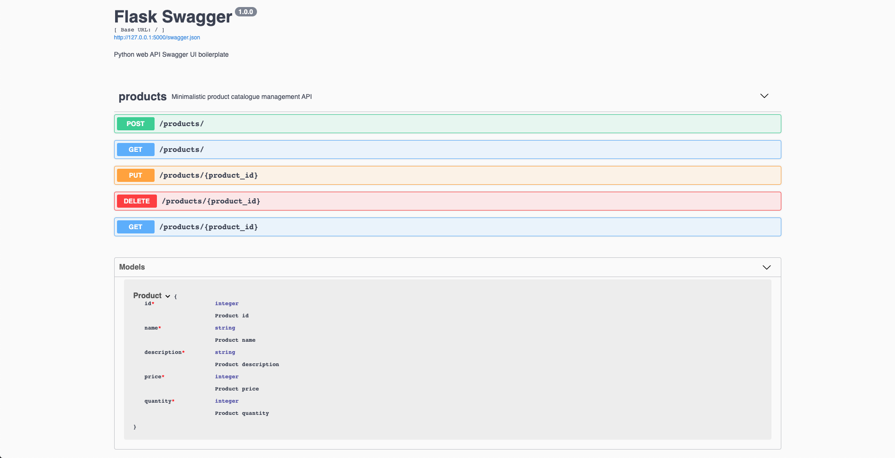

# Flask Swagger



## Description:

Python web API Swagger UI boilerplate.

### Tech Stack:

Built using Python, [Flask](https://github.com/pallets/flask), and [Flask-RESTX](https://github.com/python-restx/flask-restx).

## Dev Environment Setup:

```bash
# Initialize virtual environment
$ pipenv shell

# Install dependencies
$ pipenv install

# Run server (http://localhost:5000)
python3 app.py
```

## Swagger UI:

Navigate to generated Swagger UI in your browser of choice at http://localhost:5000

## REST API Endpoints:

- GET /products
- GET /products/:product_id
- POST /products
- PUT /products/:product_id
- DELETE /products/:product_id
